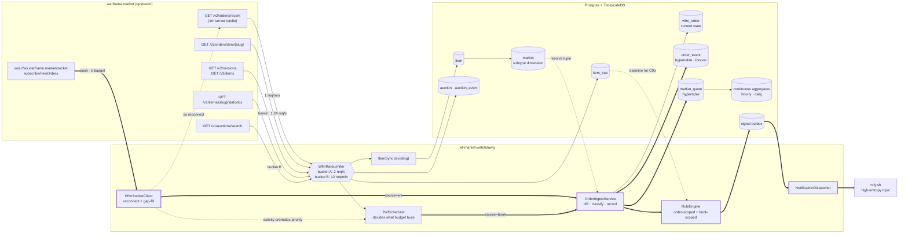
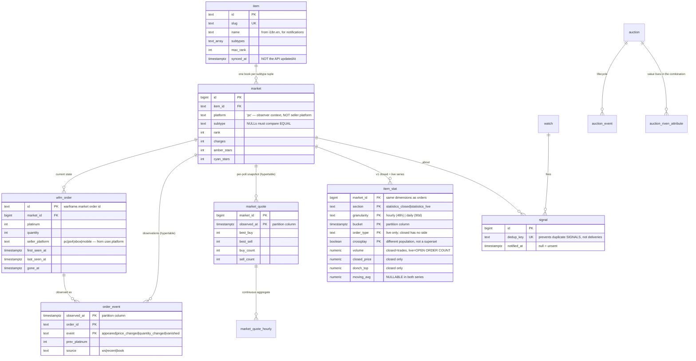
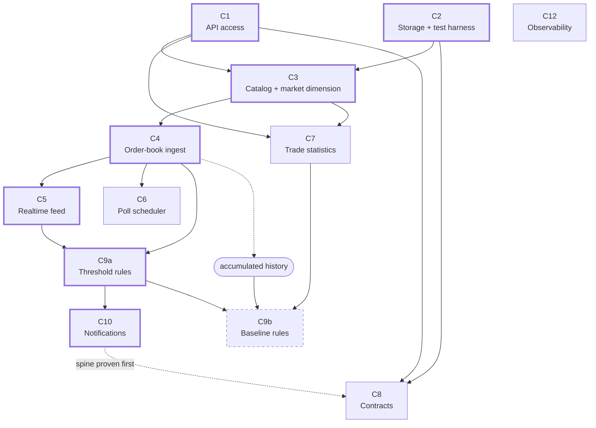
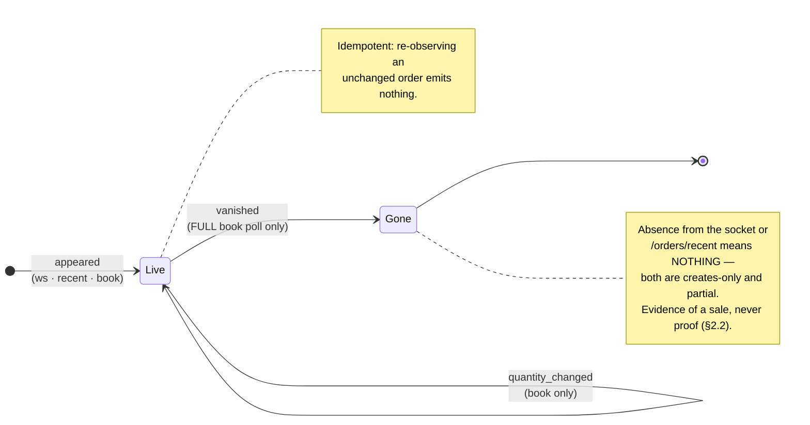
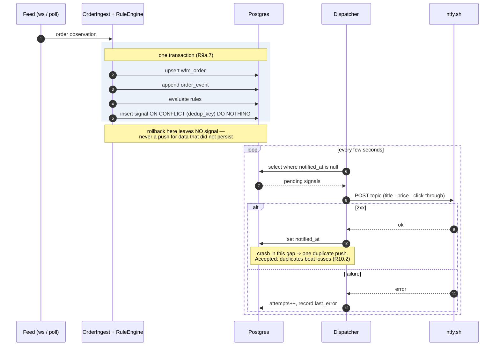

# SPEC — wf-market-watchdawg

> **Status: under review.** Two review rounds applied (see §11 for decisions taken, §12 for what is
> still contested). Round two added crossplay coverage — §2.7, R1.8, R7.11. Not yet broken into
> tasks, and **no code is written against this** until it is. Task refinement happens as a
> separate pass.
>
> Drafted 2026-09-09. Grounded in `docs/v2/` (API `v0.25.0`, WebSocket `v0.13.0`), `docs/v1.yml`,
> and the live-verified route table in `bruno/README.md`.

---

## 1. Objective

A single-operator service that watches warframe.market and does two things off one ingestion pipeline:

1. **Watchdog** — detect market moves worth acting on and push them to ntfy within seconds.
2. **Warehouse** — retain order-book and auction history indefinitely, so questions can be asked later that nobody thought to ask up front.

**User:** one operator (the author). Watches are declared in a version-controlled YAML file so they are reviewable in git rather than living only in a database. The warehouse is read directly from Postgres (`mpsql`, or any BI tool pointed at it) — there is no query API and no UI. The service only writes.

**Outcome that defines success:** a push notification arrives on a phone, within seconds of a qualifying order being posted, containing enough information to act — and a year later the database can answer what that item's price did over that year.

### Non-goals
- Placing, modifying or closing orders. This service observes.
- Mirroring or replacing the warframe.market website (`docs/v2/rules/overview.md` forbids it).
- Multi-platform coverage. **PC is the only platform context.** Crossplay-enabled orders from `ps4`, `xbox` and `mobile` *are* in scope — a PC operator can trade with them (§2.7). Per-platform non-PC markets (an `xbox` view of the market in its own right) are not.
- Any claim about completed trades beyond what §2 says is observable.
- A query API or UI over the warehouse. Read it with psql. *(Dropped during spec review — see §11.)*

---

## 2. Domain constraints

These are properties of the upstream API, not choices. They bound every module below.

### 2.1 The rate budget is sufficient; scaling is a prioritization problem

Two facts change the shape of the design:

- **`wss://ws.warframe.market/socket` exposes `@wfm|cmd/subscribe/newOrders`** (`docs/v2/websockets/subscriptions.mdx`) — an unauthenticated live feed of every newly posted visible order across the whole market, payload is the full `Order` model, for **zero REST budget**. Not mentioned in `docs/response.md` or `CLAUDE.md`.
- **`/v2/orders/recent` is server-cached with a 1m refresh** — 500 orders from the last 4h for **1 req/min**. Polling faster buys nothing.

Whole-market new-order coverage therefore costs one socket plus ~1,440 req/day, leaving the REST budget for order-book depth. Measured against ~3.8k items (`bruno/v2/manifests/list-items.bru`):

| Consumer | Cadence | req/day | sustained |
| --- | --- | --- | --- |
| WS `newOrders` | push | 0 | 0 |
| `/v2/orders/recent` | 60s | 1,440 | 0.017/s |
| `/v2/versions` + `/v2/items` | 1h, hash-gated | ~30 | ~0 |
| Order books — 200 hot @5m, 800 warm @30m, 2800 cold @6h | tiered | 107,200 | 1.24/s |
| v1 `statistics` | daily per item | 3,800 | 0.044/s |
| **v2 bucket total** | | **~112,500** | **~1.3/s** |
| v1 `/auctions/search` (~220 weapon slugs) | 2h sweep | 2,640 | separate bucket |

**~1.3 req/s against a 3 req/s ceiling.** No capability in this spec requires more.

### 2.2 Trade data exists, but only aggregated

> **Corrected 2026-09-09.** The first draft of this spec claimed completed sales were unobservable. The statistics capture (§2.6) showed that was too strong, and the correction *widens* what the warehouse can honestly claim.

- **No per-trade tape.** `Transaction` (`docs/v2/data-models.mdx`) is produced only by `POST /v2/order/{id}/close`, auth-gated to your own orders. Individual trades, and real-time trade events, are not observable.
- **Aggregated completed trades are observable.** v1 `statistics_closed` returns OHLC candles over genuinely closed orders — open/closed/min/max/avg/volume-weighted/median price plus `volume` — hourly for 48h and daily for 90d. Schema: `docs/v1-statistics.md`.
- It also ships precomputed `moving_avg` and Donchian channel bounds, so some indicator work comes free.

Consequences:
- Real-time move detection is still defined over *order-book* events, because trade data lags by at least one bucket.
- Long-term analysis has real traded prices and volumes, not merely order-book inference.
- Order disappearance remains *evidence of*, never *proof of*, a sale.
- **`statistics_live.volume` is a count over open orders, not trade volume** — 2008 vs 1 for the same bucket on `frost_prime_set`. Conflating the two series would silently corrupt every volume metric in the warehouse.

### 2.3 An item is many order books

`Order` carries `subtype`, `rank`, `charges`, `amberStars`, `cyanStars`, and `/top` exposes all five as filters. A price without its dimension tuple is meaningless. A **market** is the unique tuple `(item, platform, subtype, rank, charges, amberStars, cyanStars)`.

`platform` in that tuple is the **observer's context** (`pc`), not the counterparty's. A market is the set of mutually-tradable orders — that is the thing whose best bid and best ask mean anything — and with crossplay on, a PC operator can trade with every order returned (§2.7). Partitioning by seller platform would split one tradable pool into four and force every C9a rule to aggregate back across them to stay correct. The counterparty's platform is an **attribute of the order** (`wfm_order.seller_platform`), not a dimension of the book.

### 2.4 Contracts exist only in v1

v2 has a `contracts` concept (`Group.kind`, OAuth scope) but **ships no public routes**. Riven/lich/sister auctions are reachable only via v1, which uses a `payload`/`include` envelope and snake_case. `/auctions/search` **cannot be enumerated** — it requires a weapon or an attribute.

### 2.5 Two upstream limits, not one

`docs/v2/rules/overview.md`: the general limit is 3 req/s, but **contract search is expected to be limited to 10–20 req/minute**. Separate budget, separate bucket.

### 2.6 The statistics schema, now captured

`/v1/items/{slug}/statistics` is undocumented upstream — absent from `docs/v1.yml`, no v2 equivalent. **Captured 2026-09-09 across six slugs chosen to exercise every subtype dimension; schema recorded in `docs/v1-statistics.md`. C7 is no longer blocked.**

Three findings that changed the design rather than merely unblocking it:

1. Statistics split by the **same subtype dimensions as orders** (`mod_rank`, `subtype`, `amber_stars`, `cyan_stars`), so rows key to a **`market`**, not just an `item` — the dimension table earns its keep twice.
2. The "48h and 90d buckets" note understated the payload: each window carries **two different series** with different field sets — `statistics_closed` (real trades, OHLC, no side) and `statistics_live` (open book, has `order_type`, no OHLC).
3. **Mapping hazard:** no `charges` field appears anywhere. Requiem mods, which v2 models with `maxCharges`, report `mod_rank: 3`. Mapping `mod_rank` → `rank` unconditionally would collapse those onto the wrong market.

### 2.7 Crossplay is one setting, and the two APIs disagree on what it means

`Platform: pc` + `Crossplay: true` adds crossplay-enabled orders from other platforms to the PC view. It costs **zero rate budget** — a header on calls already being made, and a payload field on a socket that spends nothing — so §2.1's arithmetic is unchanged. **Measured 2026-09-09:**

| | `Crossplay: false` | `Crossplay: true` |
| --- | --- | --- |
| `/v2/orders/item/frost_prime_set` | 856 orders, all `pc` | 899 — `pc` 856, `ps4` 29, `xbox` 12, `mobile` 2 |
| Set relationship | — | **strict superset**; all 856 PC orders byte-identical |
| `/v2/orders/recent` | 431, all `pc` | 432, non-PC share **32/432 = 7.4%** |

Three properties that shape the design:

1. **Every order is platform-attributable.** `user.platform` and `user.crossplay` were present on 1,331 of 1,331 sampled orders, despite `Order.user` being flagged `optional/contextual` in `docs/v2/data-models.mdx`.
2. **`switch` never appears.** The server forces `crossplay: false` for it (`docs/v2/websockets/subscriptions.mdx`). Crossplay is not "all platforms".
3. **The two APIs disagree.** For `/v2/orders/*`, `crossplay=true` is a strict superset. For v1 `/items/{slug}/statistics` it is a **different population** — see R7.11.

**The failure R1.8 exists to prevent.** REST defaults `Crossplay` to `false`; the socket defaults it to **`true`**. Mixing them breaks C4's classifier:

1. Socket sees a new `xbox` order → `appeared`, `source=ws` (R4.2).
2. The next full book poll runs with `Crossplay: false`, so that order is absent from the response.
3. R4.1 diffs the book against known state → classifies it **`vanished`**.

That is a false `vanished` on ~7% of ingested orders, on exactly the event §2.2 treats as evidence-of-sale and R9b.2 measures lifetimes from. It would stay invisible until someone asked why non-PC sellers appear to sell instantly.

**Why orders are safe to widen and statistics are not.** For orders the setting is lossless: a superset plus a per-order platform tag means the PC-only view stays reconstructible forever with a `where` clause, so *not* enabling it is the lossy choice. For statistics, no field distinguishes the two populations, so the scope has to be recorded in the row (R7.11).

---

## 3. Architecture & capability map

### 3.1 Ingestion dataflow

Two ingestion channels converge on one ingest service, which both writes history and evaluates rules. The single most important structural property: **every REST call passes through one limiter, and the WebSocket bypasses it because it spends no budget.**

Thick edges trace the spine: socket → ingest → rules → outbox → push. Dotted edges are feedback and reference lookups, not data flow.

### 3.2 Data model

A star schema. `market` is the dimension that makes a price meaningful (§2.3); the fact tables carry a thin `bigint` reference so hypertable rows stay small and compress well.

Every unique index on a hypertable includes the partition column — a Timescale requirement, which is why the facts have composite natural keys rather than a surrogate `bigserial`.

### 3.3 Capability dependency graph

Thick nodes are the spine — the shortest path to a real push notification. C7 was blocked on a schema capture and no longer is (§2.6). C9b remains dashed: it needs C7 *plus* accumulated history before any threshold in it can be chosen honestly.

### 3.4 Capability table (approved)

| id | Capability | Depends on |
| --- | --- | --- |
| **C1** | API access — rate limiter, v2 + v1 clients, retry | — |
| **C2** | Time-series storage + test harness | — |
| **C3** | Catalog & market dimension | C1, C2 |
| **C4** | Order-book ingest | C3 |
| **C5** | Realtime feed | C4 |
| **C6** | Poll scheduler | C4 |
| **C7** | Trade statistics | C1, C3 |
| **C8** | Contracts / auctions | C1, C2 |
| **C9a** | Threshold rules | C4, C5 |
| **C9b** | Baseline rules | C7, C9a, + history |
| **C10** | Notifications | C9a |
| **C12** | Observability | cross-cutting |

*C11 (query API) was dropped during spec review. IDs are left unrenumbered so requirement references stay stable.*

**Build order:** `C1 ∥ C2` → `C3` → `C4` → `C5 ∥ C6` → `C9a` → `C10`. Then `C7`, then `C8`. `C9b` last, once history has accrued. `C12` runs continuously alongside. Acyclic — nothing depends on a later module.

The spine is `C1 → C2 → C3 → C4 → C5 → C9a → C10`: the shortest path to a real push notification. **C8 (contracts) is deliberately sequenced after that spine proves out** — it shares only C1, and riven valuation is the harder modelling problem, since value lives in attribute combinations rather than a single price.

---

## 4. Module specifications

### C1 — API access

Every outbound call goes through one compliant, paced, observable path.

- **R1.1** A single rate limiter governs all outbound calls. No code path may issue an HTTP request that bypasses it — enforced at the transport layer, not at call sites.
- **R1.2** Two independent buckets: v2 public (configured 2 req/s, ceiling 3) and v1 contract search (configured 12 req/min, ceiling 20).
- **R1.3** Retries consume budget. `429`/`509` produce a bounded retry honoring `Retry-After`, then surface a typed failure.
- **R1.4** Outbound concurrency ≤ 2. `509` is a *concurrency* signal, distinct from `429`.
- **R1.5** `User-Agent` identifies the project and a contact URL, per `rules/overview.md`. Currently a bare `wf-market-watchdawg/0.1`.
- **R1.6** Two envelope shapes: v2 `apiVersion`/`data`/`error` camelCase, v1 `payload`/`include` snake_case.
- **R1.7** Non-JSON and 5xx error bodies must not produce a deserialization crash. v1 `/items/{slug}/orders` answers `403` as plain text.
- **R1.8** **Crossplay is one global setting applied identically to every channel** — the REST `Crossplay` header *and* the WebSocket `subscribe/newOrders` payload. It is not a per-call option and no call site may omit it. The two upstream defaults point opposite ways: REST defaults to `false` (`docs/v2/api/overview.mdx`), the socket to **`true`** (`docs/v2/websockets/subscriptions.mdx`). Taking either default mixes populations across channels and corrupts C4's diff — the failure is walked through in §2.7.

**Acceptance**
- N sequential calls at limit L take ≥ (N−1)/L seconds.
- A `429` fixture with `Retry-After: 2` yields exactly one retry, after ≥2s, then success.
- A plain-text `403` surfaces a typed error, not a Jackson exception.
- Over a 1h live run: sustained req/s ≤ configured, **zero** `429`/`509`.
- A recorded REST call and a recorded socket subscribe frame carry the **same** crossplay value; the test fails if either silently falls back to an upstream default (R1.8).

### C2 — Time-series storage & test harness

- **R2.1** TimescaleDB available in dev, test, and packaged deployment.
- **R2.2** Fact tables are hypertables. Every unique index includes the partitioning column.
- **R2.3** The event log is retained **indefinitely**, compressed beyond a configurable age.
- **R2.4** Quote snapshots retained raw for a bounded window; hourly and daily aggregates retained indefinitely.
- **R2.5** Migrations that cannot run inside a transaction (continuous aggregates, policies) are marked as such and apply cleanly via **both** Gradle and the `mflyway` CLI, which share one history table.
- **R2.6** **No test may reach the live warframe.market API.** Scheduled components are disabled by default under test.
- **R2.7** Tests are order-independent. The shared container's state is reset between tests.

**Acceptance**
- `mflyway info` clean from scratch; `mbuild` green.
- `ItemRepositoryTest` passes alone *and* in any order alongside others (it currently asserts `count() == 1` and is order-dependent).
- A test asserts the context starts with scheduling off and records zero outbound HTTP.
- A row older than the compression threshold yields a compressed chunk after the policy runs.

### C3 — Catalog & market dimension

- **R3.1** `item` carries everything downstream needs: `subtypes`, `maxRank`, `maxCharges`, `maxAmberStars`, `maxCyanStars`, `bulkTradable`, `tradable`, `rarity`, `vaulted`, plus display `name` and `icon` from `i18n.en` (notifications need a human-readable title).
- **R3.2** `Item` has **no `updatedAt`** in the v2 spec. The existing column is `Instant.EPOCH` on every row — it becomes a local `synced_at`.
- **R3.3** Market resolution (§2.3 tuple → id) is idempotent and safe under concurrency.
- **R3.4** NULL subtype dimensions must compare **equal** for uniqueness. Postgres treats NULLs as distinct by default, which would silently defeat upserts for the common no-subtype case.
- **R3.5** Catalog refresh stays version-hash gated. The existing `CollectionSync` contract is **not modified** — it works and its extension point is documented.

**Acceptance**
- The real `/v2/items` payload yields ~3.8k rows, with non-empty `subtypes` on known multi-subtype items.
- Resolving one tuple twice returns one id; two concurrent resolutions of a new tuple create one row.
- Rank-0 and rank-10 orders on `serration` resolve to two distinct markets.
- No row has `synced_at` = epoch.

### C4 — Order-book ingest

- **R4.1** Given a full book, classify each order as `appeared` / `price_changed` / `quantity_changed` / `vanished` against last known state.
- **R4.2** Every observation appends to an immutable event log carrying previous values and its source (`ws` | `recent` | `book`).
- **R4.3** Each book poll writes exactly one quote row per market observed: best bid, best ask, order counts, quantities, depth, online counts.
- **R4.4** Ingest is **idempotent** — replaying the same book produces no new events.
- **R4.5** `vanished` is inferred **only** from a full book poll. The socket and `/recent` are creates-only and partial; absence there means nothing.
- **R4.6** An order for an unknown market creates that market.

The classification below is the correctness core of the whole service; everything downstream trusts it. Note which sources can drive which transitions — this is R4.5 drawn out, and it is the subtle part:

**Acceptance**
- Book A then A → zero new events.
- A then A' with one price change → exactly one `price_changed` carrying the previous value.
- A then A'' missing an order → exactly one `vanished`.
- Quote rows == successful polls.
- A mixed-rank `/orders/item/{slug}` response splits across the correct markets.

### C5 — Realtime feed

- **R5.1** Connect with the required `wfm` subprotocol. Connections without it are rejected by the server.
- **R5.2** Subscribe to `newOrders` for the configured platform, sending `crossplay` **explicitly** from the single global setting (R1.8) rather than relying on the socket's `true` default; handle `:ok` and `:error` (`alreadySubscribed`).
- **R5.3** Reconnect indefinitely with exponential backoff plus jitter.
- **R5.4** On every (re)connect, gap-fill from `/v2/orders/recent` — its 4h window covers any realistic outage.
- **R5.5** Socket events feed the same ingest path as polling, tagged `source=ws`.
- **R5.6** Unknown routes and malformed frames are logged and skipped, never fatal. Note `docs/v2/websockets/subscriptions.mdx` warns that item and profile subscriptions exist as unregistered stubs — do not rely on them.

**Acceptance**
- Against a local fake WS server: handshake completes and a `newOrder` event produces an `appeared` event.
- Killing the connection reconnects with no duplicate events.
- A malformed frame does not terminate the connection.
- Socket state is observable via C12.

### C6 — Poll scheduler

- **R6.1** Poll targets are database rows: kind, ref, tier, interval, next-due.
- **R6.2** Draining is safe under concurrency, so a second instance cannot double-poll.
- **R6.3** Unchanged results back off multiplicatively to a per-tier cap; changes tighten the interval.
- **R6.4** A realtime event for an item advances that item's next-due time — **push informs poll priority**, so attention follows real activity instead of a fixed schedule.
- **R6.5** Aggregate demand stays within the C1 budget **by construction**. The scheduler is the component that decides how much budget is spent, so this is its responsibility, not a happy accident.

**Acceptance**
- Two concurrent drains never return the same target.
- N unchanged polls produce the documented interval progression, capped.
- A socket event on a cold-tier item measurably advances its due time.
- A simulated full-catalog schedule stays under the configured req/s.

### C7 — Trade statistics

Schema captured (§2.6, `docs/v1-statistics.md`). Requirements are now concrete.

- **R7.1** Both series are stored and **never conflated**: `statistics_closed` (real trades, OHLC + Donchian, no side) and `statistics_live` (open-book aggregates, has `order_type`, no OHLC). `volume` means different things in each — trades vs open-order count. A single table discriminated by a `section` column is acceptable; merging the two into one row shape is not.
- **R7.2** Both granularities recorded: hourly (48h window) and daily (90d).
- **R7.3** Upsert key is the logical tuple `(section, granularity, bucket, dimensions[, order_type], crossplay)`, verified unique across all 3,386 sampled rows. The row's own `id` is stored alongside but **not** used as the key. **Confirmed 2026-09-09: `id` is unstable.** Refetching `frost_prime_set` at an unchanged crossplay setting is byte-identical (0/88 rows differ, ids stable), but flipping `Crossplay` changes **88/88 row ids** on historical buckets whose values did not move. Keying on `id` would have duplicated the entire history the first time that header changed. The earlier "assumed, not confirmed" caveat is now resolved — against `id`.
- **R7.4** Rows key to a **`market`** (C3), not an `item`, since statistics carry the same subtype dimensions as orders. Field names are snake_case: `mod_rank` → `rank`, `amber_stars` → `amberStars`, `cyan_stars` → `cyanStars`.
- **R7.5** **`mod_rank` must not be mapped to `rank` unconditionally.** Requiem mods report `mod_rank: 3` where v2 models `maxCharges`; a naive mapping collapses them onto the wrong market. Resolve using the item's own `maxRank`/`maxCharges` from C3.
- **R7.6** All price fields bind as **decimal**, never integer — `donch_top`, `donch_bot`, `median`, `min_price`, `max_price` arrive as JSON int *or* float depending on value (`150` vs `80.0`). `volume` is always an integer.
- **R7.7** `moving_avg` is **nullable in both series** (absent on ~2% of closed and ~54% of live rows). A non-null constraint would reject real data.
- **R7.8** A dimension field is *absent*, not null, when the item lacks that dimension. Parsing must not treat absence as zero — rank 0 is a real, distinct market.
- **R7.9** v1 timestamps (`+00:00` with millis) parse alongside v2 (`Z`).
- **R7.10** `statistics_closed` is sparse — buckets exist only where trades occurred. Gaps are data, not errors, and must not be interpolated on ingest.
- **R7.11** **`crossplay` is part of the row's identity**, because the two settings return *different populations, not a superset*. Flipping the header changed 76 of 88 historical closed-daily rows on `frost_prime_set`, and `volume` moved **down** (51 → 41 for the 2026-06-12 bucket), so `crossplay=true` here is not additive the way `/v2/orders/*` is (§2.7). Nothing in the row records which population produced it, so the column must. Storing it keeps the choice reversible; omitting it makes any later change to the setting silently overwrite history with differently-scoped numbers — an unrecoverable corruption with no error at the time it happens.

**Acceptance**
- Ingesting the captured `frost_prime_set` fixture twice leaves one row per logical key.
- `serration` yields distinct rows for `mod_rank` 0 and 10; `axi_a1_relic` for `intact` and `radiant`; `ayatan_anasa_sculpture` for its star combinations.
- `khra` does **not** land on the same market as a rank-3 non-requiem item (R7.5).
- A row with `donch_top: 150` and one with `80.0` both persist without error.
- A row lacking `moving_avg` persists as null.
- Closed and live volume for one bucket are retrievable separately and differ by orders of magnitude on a liquid item.
- Ingesting one slug at both crossplay settings leaves **two** distinct row sets, not one overwritten set (R7.11).
- Refetching at an unchanged setting is idempotent even though every row `id` would differ at the other setting (R7.3).

### C8 — Contracts / auctions

- **R8.1** Riven, lich and sister auctions recorded with their polymorphic item payload.
- **R8.2** Riven attributes are normalized — the attribute *combination* is what carries value, so it must be queryable.
- **R8.3** Auction lifecycle observed: top-bid changes, closure, disappearance.
- **R8.4** Sweeps iterate weapon slugs from the v2 riven/lich/sister manifests, because `/auctions/search` cannot be enumerated (§2.4).
- **R8.5** Uses the C1 contract-search bucket exclusively (§2.5).

**Acceptance** — a riven search fixture yields an auction plus normalized attributes; a second sweep with a changed top bid records one event; pacing stays within 12/min.

### C9a — Threshold rules

- **R9a.1** Watches are declared in a version-controlled YAML file loaded at startup.
- **R9a.2** Invalid config fails startup loudly, naming the offending entry.
- **R9a.3** Three families: **underpriced listing** (order-scoped, socket-driven), **best price crosses** (book-scoped), **spread above margin** (book-scoped).
- **R9a.4** A watch selects a market by item plus optional subtype dimensions.
- **R9a.5** Signals carry a dedup key; the same condition cannot fire twice within its cooldown.
- **R9a.6** Rules are a keyed strategy registry — deliberately **not** an expression language.
- **R9a.7** Signals are written in the same transaction as the ingest that produced them.
- **R9a.8** **The alert budget is 10–50 notifications/day across all watches.** Cooldowns and thresholds are tuned against that ceiling, and sustained breach is a defect, not a configuration preference — a muted watchdog is a broken one. Requires C12 to measure (R12.3).

**Acceptance**
- A watch naming a nonexistent item slug fails startup with that slug in the message.
- A synthetic order under threshold → exactly one signal; a repeat within cooldown → none.
- Rolling back an ingest transaction leaves no signal.
- The spread rule fires only when both sides exist.
- Over a 72h live run, notification volume sits inside the R9a.8 budget.

### C9b — Baseline rules

- **R9b.1** Volume spike is relative to the item's own trailing baseline from C7, never an absolute number.
- **R9b.2** Vanish-fast requires a measured lifetime from the event log (appeared→vanished under a threshold).
- **R9b.3** Neither ships before enough history exists to calibrate. **Thresholds are derived from recorded data, not guessed.**
- **R9b.4** These rules share the R9a.8 alert budget rather than adding to it. Baseline rules fire on statistical unusualness, which is exactly the class of rule that floods, so they are the first candidates for tightening if the budget is breached.

**Acceptance** — a backtest over recorded events produces a signals/day rate that fits inside the R9a.8 budget alongside the threshold rules, not an unbounded stream.

### C10 — Notifications

- **R10.1** Delivery is an outbox: signals are durably queued and sent by a separate dispatcher.
- **R10.2** Delivery is **at-least-once**. The dispatcher marks a signal sent only after a 2xx from ntfy, so a crash between send and mark may re-deliver one notification. It must never silently drop one. Exactly-once is unavailable — ntfy exposes no idempotency key — and for an alerting system a rare duplicate push is strictly preferable to a lost one.
  - Note the division of labour: `signal.dedup_key` prevents a rule from producing duplicate **signals**; it does not and cannot prevent duplicate **deliveries** of one signal.
- **R10.3** Failures retry to a bounded attempt count and record the last error.
- **R10.4** A notification carries the item display name, the price, and a click-through to the warframe.market item page.
- **R10.5** Watch priority maps to ntfy priority.
- **R10.6** Delivery targets public `ntfy.sh` with a **high-entropy topic name**. That name is a bearer credential — anyone who learns it can read every notification. It is therefore supplied by environment/external config, **never committed and never logged**. Watch YAML (R9a.1) references a topic by *logical name* only; the mapping to a real topic resolves at runtime. See §9.
- **R10.7** The `Notifier` abstraction stays host-agnostic so a self-hosted ntfy remains a drop-in later, without reworking C9a.

The transaction boundary is what makes R9a.7 and R10.2 hold together — a signal and the data that justified it commit or roll back as one unit, and delivery is a separate concern entirely:

**Acceptance**
- Mock ntfy: one signal → one POST; forced failure retries to cap then marks failed.
- Killing the process between signal write and send yields delivery on restart. A duplicate here passes; a loss fails.
- One real end-to-end push arrives on a phone.
- `git grep` over the repo finds no real topic name; logs at DEBUG contain no topic name.

### C12 — Observability

- **R12.1** Outbound req/s consumed **per bucket**, as a metric. This is how the rate-limit boundary is proven at runtime rather than assumed.
- **R12.2** Socket connection state and reconnect count.
- **R12.3** Ingest throughput, plus signal and notification counts — the latter is how R9a.8's alert budget is measured rather than guessed at.
- **R12.4** Poll queue depth and oldest overdue target.
- **R12.5** With C11 dropped, these metrics are the service's **only** HTTP surface. Actuator only; no data endpoints.

**Acceptance** — after an hour running, the metrics answer "are we under the limit", "is the socket up", "is the queue keeping up", and "how many pushes today" without reading logs.

---

## 5. Commands

Per `CLAUDE.md`. `nix develop` provides the toolchain; `mhelp` lists the shell functions. Docker must be running.

| Task | Dev shell | Direct |
| --- | --- | --- |
| Build + test | `mbuild` | `cd market && ./gradlew build` |
| Tests only | `mtest` | `./gradlew test` |
| One test class | `mtest --tests '*ItemRepositoryTest'` | same |
| Run | `mrun` | `./gradlew bootRun` |
| psql | `mpsql` | `psql -h localhost -p 5432 -U watchdawg -d watchdawg` |
| Reset DB | `mdb-reset` | `docker compose down -v` |
| Flyway | `mflyway info` | see `flake.nix` |
| Replay API collection | `bruno-run` | `cd bruno && npx @usebruno/cli run --env production --delay 400 -r` |

Hermetic jar: `nix build .#market`. **Any dependency change requires** `$(nix build --no-link --print-out-paths .#market.mitmCache.updateScript)` from the repo root.

## 6. Project structure

Gradle root is `market/`, not the repo root.

| Package | Role |
| --- | --- |
| `wfm` | *existing.* Rate limiter, v2 client, v1 legacy client |
| `wfm/ws` | Socket client, envelope models, reconnect supervisor |
| `sync` | *existing, untouched.* `CollectionSync` SPI |
| `ingest` | Book diffing, order state, event log, quotes |
| `poll` | Tiered adaptive target queue |
| `watch` | Config loading, rule registry, signal outbox |
| `notify` | ntfy delivery |
| `store` | Records + repositories |

## 7. Code style

- **4 spaces** for indentation (Kotlin official style), enforced by Spotless + ktlint rather than by convention. `spotlessCheck` runs as part of `build`; `spotlessApply` fixes. Config is `market/.editorconfig` — it must live in the Gradle root, since Spotless does not discover `.editorconfig` above it, and the Gradle daemon caches it (`./gradlew --stop` after editing).
- **ktlint cannot format inside raw-string SQL.** The `@Query` literals in `store/` are string content, so their indentation is maintained by hand and no tool will catch drift there.
- **Spring Data JDBC, not JPA.** No dirty checking, no lazy loading; `save()` on an assigned id issues `UPDATE`. Upserts are hand-written `@Modifying @Query` with `on conflict … do update`, each paired with a record-taking extension function so call sites stay readable.
- **A new column touches three places:** the migration, the record, and both the SQL and the parameter list of the upsert.
- Natural-id records implement `Persistable` with a `@Transient val new` flag; prefer the `upsert` extension over `save()`.
- **Jackson 3** — the package is `tools.jackson`, not `com.fasterxml.jackson`. v2 is camelCase, so no naming strategy. Declare only the fields actually used.
- Compiler args `-Xjsr305=strict`, `-Xannotation-default-target=param-property`.
- Migrations are `V<n>__desc.sql`; the app and the `mflyway` CLI deliberately share one history table.

## 8. Testing strategy

- Every test is a `@SpringBootTest` with a Testcontainers Postgres. Identical annotation sets share one context **and one container**, so **order-independence is mandatory** (R2.7).
- `MockRestServiceServer` bound to `RestClient.Builder` for HTTP — already available via `spring-boot-starter-webmvc-test`, no new dependency. **No test reaches the live API** (R2.6).
- Fixtures are captured from the `bruno` collection so they match reality.
- `WfmClient.get()` is `private inline` and cannot be stubbed — test through the HTTP layer, not by mocking the client.
- **C4's diff logic gets the densest coverage.** It is where correctness actually lives; everything downstream trusts its output.
- `bruno-run` re-verifies live contracts after any DTO change. Manual, never in CI.

## 9. Boundaries

**Always**
- Pace every outbound call through the limiter.
- Identify the client honestly in `User-Agent`.
- Gate catalog refetch on the version hash.
- Prefer WebSocket and incremental updates over polling, per `rules/overview.md`.
- Keep ingest idempotent.

**Ask first**
- Adding any dependency (forces a `nix/deps.json` regeneration).
- Changing retention or compression policy.
- Calling any new upstream endpoint (it spends budget).
- Schema changes to fact tables.

**Never**
- **Write to warframe.market.** No `POST`/`PATCH`/`DELETE` on orders or auctions, ever. `rules/overview.md` calls trade bots a grey area with stricter limits coming; staying observational keeps this clearly onside.
- **Exceed the documented rate limit**, or attempt to raise effective throughput via proxy rotation, multiple egress paths, or a browser-impersonating `User-Agent`. A `429`/`509` is a bug in our pacing. `rules/overview.md` reserves the right to restrict by "IP addresses, networks, cloud providers… or traffic patterns" and to block clients that make traffic "difficult to classify" — evasion targets exactly what they police, on a community service with limited infrastructure.
- **Store trader PII beyond what a notification needs.** Orders carry `ingameName`, `reputation`, `lastSeen`, `activity`. Don't accumulate trader profiles.
- **Present inferred sales as fact.** There is no trade tape (§2.2).
- **Reach the live API from a test.**
- **Commit or log the ntfy topic name.** On public `ntfy.sh` it is a bearer credential (R10.6). It does not belong in the watch YAML, in `application.yaml`, or in a log line.

## 10. Open questions

1. ~~C7 blocked on a statistics capture.~~ **Resolved 2026-09-09** — captured across six slugs, documented in `docs/v1-statistics.md`, C7 requirements now concrete (R7.1–R7.11). One residual unknown: whether v1 `mod_rank` carries v2 `charges` for requiem items (R7.5) — resolvable from the C3 catalog's `maxRank`/`maxCharges` rather than more captures.
2. **Timescale + Postgres version.** `compose.yaml` pins `postgres:18-alpine`. Confirm whether a TimescaleDB pg18 image exists; if not, C2 pins pg17 and the dev volume must be reset (`mdb-reset`) since the data directory is incompatible.
3. **C9b thresholds are deliberately unspecified** — they cannot be chosen honestly before history exists (R9b.3).
4. **Kafka starters are on the classpath with zero producers.** Recommendation: leave them (they connect lazily, so they're harmless) and do **not** wire Kafka. The event log *is* the replayable append-only log `docs/response.md` wanted Kafka for, and ~100k events/day is not a Postgres problem. Kafka earns its place when independent consumers or separate ingest/analysis scaling actually exist.
5. ~~ntfy topic secrecy.~~ **Resolved:** public `ntfy.sh` with a high-entropy topic, treated as a credential (R10.6, §9).
6. **What does `Crossplay` actually mean to v1 `/items/{slug}/statistics`?** The header appears nowhere in `docs/v1.yml`, yet it deterministically rewrites 76/88 historical rows and *lowers* `volume` (§2.7, R7.11). Best reading: trades where **both** sides are crossplay-enabled, which would exclude the PC-crossplay-off cohort — 6 such users appeared in the sampled book. That is an inference from one slug and the direction of one number. Resolvable by sampling more slugs, and worth doing before C7 ingests at scale, but R7.11 is written so the answer is **not** load-bearing.

---

## 11. Decisions taken during spec review

| Decision | Rationale |
| --- | --- |
| PC only | Avoids 5× budget and storage for platforms not traded on. |
| Contracts = v1 riven/lich/sister auctions | v2 has the concept but ships no public routes (§2.4). |
| Full event log retained forever + rollups | Lets future questions be asked of past data; compression makes it affordable. |
| TimescaleDB over native partitioning | Hypertables, continuous aggregates and compression do the retention work directly. |
| Rate-limit discipline is a **hard boundary** | Initially left out of the boundaries, then promoted on review. Costs nothing — the design fits in ~1.3 of 3 req/s. |
| Live-API-free tests are a C2 **requirement**, not a boundary | Same fix either way; recorded as scoped work rather than an inviolable rule. |
| All four signal families wanted | Two of them (C9b) are gated on history and cannot ship with the others. |
| Watches in version-controlled YAML | Reviewable in git, unlike DB rows. |
| **C11 query API dropped** | Largest module, least clear payoff for one operator. psql is the read surface; revisit as its own spec round once real queries are known. |
| **C8 sequenced after the item spine** | Shares only C1; riven valuation is the harder problem and shouldn't block a working notification path. |
| Alert budget 10–50/day | Makes cooldowns and C9b calibration measurable instead of aspirational (R9a.8). |
| Kafka stays unwired | The event log *is* the replayable log; ~100k events/day is not a Postgres problem. |
| **§2.2 widened after the capture** | Aggregated completed-trade data *is* available; the original "no trade tape" claim was too strong. Per-trade and real-time remain unavailable. |
| **`item_stat` keys to `market`, not `item`** | Statistics carry the same subtype dimensions as orders, so the dimension table serves both fact families. |
| **Two statistics series kept separate** | `closed.volume` counts trades, `live.volume` counts open orders. Merging them would corrupt every volume metric. |
| **Crossplay enabled, PC context** | Zero budget cost, +7.4% of the new-order feed, and losslessly reversible for orders since every order carries `user.platform` (§2.7). Not enabling it is the lossy choice. |
| **Crossplay is one global setting (R1.8)** | REST and the socket default opposite ways; mixing them fabricates `vanished` events on ~7% of orders. |
| **`market.platform` is observer context, not seller platform** | A market is a mutually-tradable pool; seller platform is an attribute of the order (§2.3). |
| **`crossplay` joins `item_stat`'s logical key** | The two settings return different populations and the row records neither. One column keeps the decision reversible (R7.11). |

## 12. Still worth disagreeing with

- **R6.5** makes the poll scheduler responsible for budget compliance. This is the most load-bearing decision in the spec — it is what makes §2.1's arithmetic hold at runtime rather than on paper.
- **R4.5** (vanish inferred only from full polls) costs real latency on arguably the most interesting signal: a cheap listing disappearing. The socket genuinely cannot supply removals, so the only lever is hot-tier poll cadence. Accepting that lag is deliberate.
- **§2.2** caps what any analysis built on this warehouse can honestly claim. Worth confirming that limitation is understood *before* building on it, not after.
- **R9a.8's 10–50/day budget** is currently the only number in the spec constraining signal quality. If it turns out to be the wrong ceiling, most of C9a and all of C9b get retuned.
- **C9b's volume-spike rule is now clearly implementable** — the capture confirms 90 days of real traded volume per market, which is exactly the baseline it needs. The remaining risk moved from "is the data there" to "is 90 days enough history to call a spike", which only running the thing will answer.
- **The semantics of `Crossplay` on v1 statistics are inferred, not documented** (§10 q6). R7.11 stores the flag so a wrong guess stays recoverable, but the inference is currently one slug deep and nobody upstream has confirmed it.
- **Including crossplay orders widens what the warehouse means.** Every order-book series from here on describes a PC+crossplay pool, not a PC pool, while `statistics` describes a third thing again. Anyone querying the warehouse a year out needs that in front of them, which is what `seller_platform` and `item_stat.crossplay` are for — but they only help if the query author knows to use them.
- **R7.5's `mod_rank` ambiguity** is the one unresolved correctness question in the spec. Getting it wrong silently merges requiem-mod charge levels into rank buckets, and the corruption would be invisible until someone queried those items specifically.
