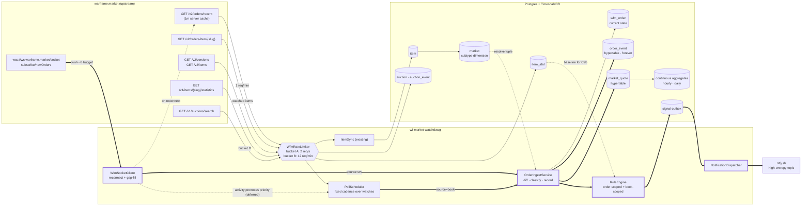
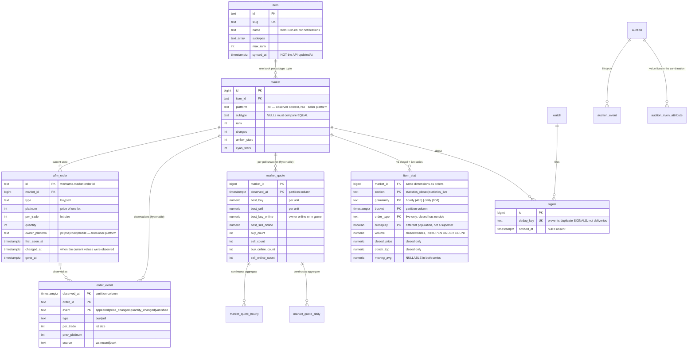
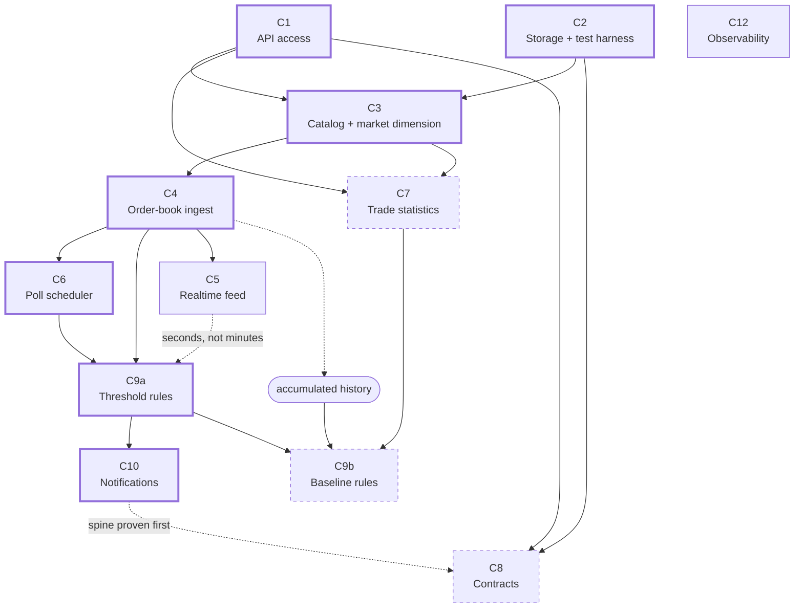
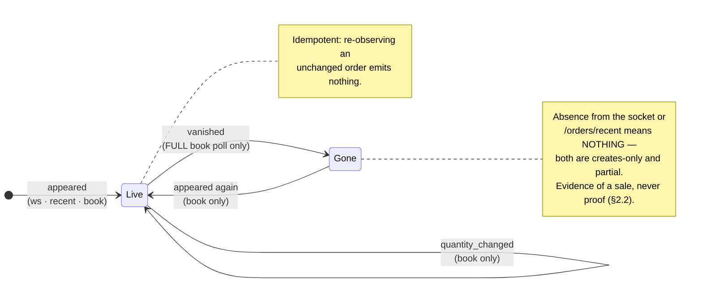
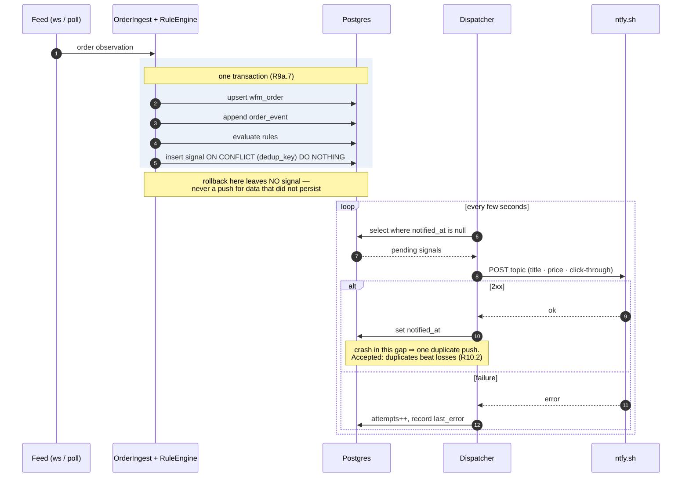

# SPEC — wf-market-watchdawg

> **Status: under review.** **No code is written against a capability until it is broken into
> tasks.** The capability in progress is planned in `tasks/plan.md` and `tasks/todo.md`; finished
> ones are archived under `tasks/archive/`.
>
> | Capability | State |
> | --- | --- |
> | C1 | **Built.** R1.1–R1.8 each map to a named passing test; R12.1's per-bucket meters ship with it. |
> | C2 | **Built and reviewed.** R2.1–R2.7 each map to a named passing test or a recorded manual check. |
> | C3 | **Built and reviewed.** Three acceptance bullets map to named tests; the fourth, and the detail sweep, to live runs recorded in `tasks/archive/c3-todo.md`. The sweep is off by default until a rule or query reads its fields. |
> | C4 | **Built**, with corrections to C1 from the 2026-09-25 review. Every acceptance bullet maps to a named test on live captures; nothing calls ingest on a schedule until C6. Awaiting review. |
>
> Grounded in `docs/v2/` (API `v0.25.0`, WebSocket `v0.13.0`), `docs/v1.yml`, and the live-verified
> route table in `bruno/README.md`. This document describes the system to be built; the reasoning
> behind its design decisions — context, rejected alternatives, trade-offs — lives in
> [`docs/adr/`](docs/adr/README.md).

---

## 1. Objective

A single-operator service that watches warframe.market and does two things off one ingestion pipeline:

1. **Watchdog** — detect market moves worth acting on and push them to ntfy within seconds.
2. **Warehouse** — retain order-book and auction history indefinitely, so questions can be asked later that nobody thought to ask up front.

**User:** one operator (the author). Watches are declared in a version-controlled YAML file so they are reviewable in git rather than living only in a database. The warehouse is read directly from Postgres (`mpsql`, or any BI tool pointed at it) — there is no query API and no UI. The service only writes.

**Outcome that defines success:** a push notification arrives on a phone, within seconds of a qualifying order being posted, containing enough information to act — and a year later the database can answer what that item's price did over that year.

### Non-goals
- Placing, modifying or closing orders. This service observes.
- Mirroring or replacing the warframe.market website (`docs/v2/rules/overview.md` forbids it).
- Multi-platform coverage. **PC is the only platform context.** Crossplay-enabled orders from `ps4`, `xbox` and `mobile` *are* in scope — a PC operator can trade with them (§2.7, [ADR-0001](docs/adr/0001-pc-observer-context-with-crossplay.md)). Per-platform non-PC markets (an `xbox` view of the market in its own right) are not.
- Any claim about completed trades beyond what §2 says is observable.
- A query API or UI over the warehouse. Read it with psql ([ADR-0011](docs/adr/0011-no-query-api-postgres-is-the-read-surface.md)).

---

## 2. Domain constraints

These are properties of the upstream API, not choices. They bound every module below.

### 2.1 The rate budget is sufficient; scaling is a prioritization problem

Two properties of the upstream API set the shape of the design:

- **`wss://ws.warframe.market/socket` exposes `@wfm|cmd/subscribe/newOrders`** (`docs/v2/websockets/subscriptions.mdx`) — an unauthenticated live feed of newly posted visible orders across the whole market, payload is the full `Order` model, for **zero REST budget**. It carries new orders only: never edits, never removals.
- **`/v2/orders/recent` is server-cached with a 1m refresh** — at most 500 orders created in the last 4h, from users online at the time, for **1 req/min**. Polling faster buys nothing.

New-order coverage therefore costs one socket plus ~1,440 req/day, leaving the REST budget for order-book depth. It is **best effort**: an outage loses whatever the 500-order, online-only window no longer holds, and a full book poll recovers current state but not the changes in between. Measured against ~3.8k items (`bruno/v2/manifests/list-items.bru`):

| Consumer | Cadence | req/day | sustained |
| --- | --- | --- | --- |
| WS `newOrders` | push | 0 | 0 |
| `/v2/orders/recent` | 60s | 1,440 | 0.017/s |
| `/v2/versions` + `/v2/items` | 1h, hash-gated | ~30 | ~0 |
| `/v2/item/{slug}` detail sweep | once per catalog change, 30/min | ~3,900 per change | 0.5/s for ~2h, then 0 |
| Order books — 200 hot @5m, 800 warm @30m, 2800 cold @6h | tiered | 107,200 | 1.24/s |
| v1 `statistics` | daily per item | 3,800 | 0.044/s |
| **v2 bucket total** | | **~112,500** | **~1.3/s** |
| v1 `/auctions/search` (~220 weapon slugs) | 2h sweep | 2,640 | separate bucket |

**~1.3 req/s against a 3 req/s ceiling.** No capability in this spec requires more. The order-book row is the long-term coverage target, not the first deliverable: C6 starts with a fixed cadence over watched items only. The detail sweep adds 0.5 req/s for about two hours after each catalog change, so the peak is ~1.8 req/s against the 2 req/s configured `public` budget. The poll scheduler (C6) has to leave room for it.

### 2.2 Trade data exists, but only aggregated

- **No per-trade tape.** `Transaction` (`docs/v2/data-models.mdx`) is produced only by `POST /v2/order/{id}/close`, auth-gated to your own orders. Individual trades, and real-time trade events, are not observable.
- **Aggregated completed trades are observable.** v1 `statistics_closed` returns OHLC candles over genuinely closed orders — open/closed/min/max/avg/volume-weighted/median price plus `volume` — hourly for 48h and daily for 90d. Schema: `docs/v1-statistics.md`.
- It also ships precomputed `moving_avg` and Donchian channel bounds, so some indicator work comes free.

Consequences:
- Real-time move detection is defined over *order-book* events, because trade data lags by at least one bucket ([ADR-0009](docs/adr/0009-detection-on-order-book-events.md)).
- Long-term analysis has real traded prices and volumes, not merely order-book inference.
- Order disappearance is *evidence of*, never *proof of*, a sale.
- **`statistics_live.volume` is a count over open orders, not trade volume** — 2008 vs 1 for the same bucket on `frost_prime_set`. Conflating the two series would silently corrupt every volume metric in the warehouse.

### 2.3 An item is many order books

`Order` carries `subtype`, `rank`, `charges`, `amberStars`, `cyanStars`, and `/top` exposes all five as filters. A price without its dimension tuple is meaningless. A **market** is the unique tuple `(item, platform, subtype, rank, charges, amberStars, cyanStars)`.

`platform` in that tuple is the **observer's context** (`pc`), not the counterparty's. A market is the set of mutually-tradable orders — that is the thing whose best bid and best ask mean anything — and with crossplay on, a PC operator can trade with every order returned (§2.7). The counterparty's platform is an **attribute of the order** (`wfm_order.owner_platform`), not a dimension of the book. See [ADR-0003](docs/adr/0003-market-is-a-mutually-tradable-pool.md).

### 2.4 Contracts exist only in v1

v2 has a `contracts` concept (`Group.kind`, OAuth scope) but **ships no public routes**. Riven/lich/sister auctions are reachable only via v1, which uses a `payload`/`include` envelope and snake_case. `/auctions/search` **cannot be enumerated** — it requires a weapon or an attribute.

### 2.5 Two upstream limits, not one

`docs/v2/rules/overview.md`: the general limit is 3 req/s, but **contract search is expected to be limited to 10–20 req/minute**. Separate budget, separate bucket.

### 2.6 The statistics schema

`/v1/items/{slug}/statistics` is undocumented upstream — absent from `docs/v1.yml`, no v2 equivalent. Its schema is recorded in `docs/v1-statistics.md`, captured across six slugs chosen to exercise every subtype dimension.

Three properties of the payload shape the design:

1. Statistics split by the **same subtype dimensions as orders** (`mod_rank`, `subtype`, `amber_stars`, `cyan_stars`), so rows key to a **`market`**, not just an `item` — the dimension table earns its keep twice.
2. The "48h and 90d buckets" note understated the payload: each window carries **two different series** with different field sets — `statistics_closed` (real trades, OHLC, no side) and `statistics_live` (open book, has `order_type`, no OHLC).
3. **Mapping hazard:** no `charges` field appears anywhere. Requiem mods, which v2 models with `maxCharges`, report `mod_rank: 3`. Mapping `mod_rank` → `rank` unconditionally would collapse those onto the wrong market.

### 2.7 Crossplay is one setting, and the two APIs disagree on what it means

`Platform: pc` + `Crossplay: true` adds crossplay-enabled orders from other platforms to the PC view. It costs **zero rate budget** — a header on calls already being made, and a payload field on a socket that spends nothing — so §2.1's arithmetic is unchanged. Measured against the live API, 2026-09-09:

| | `Crossplay: false` | `Crossplay: true` |
| --- | --- | --- |
| `/v2/orders/item/frost_prime_set` | 856 orders, all `pc` | 899 — `pc` 856, `ps4` 29, `xbox` 12, `mobile` 2 |
| Set relationship | — | **strict superset**; all 856 PC orders byte-identical |
| `/v2/orders/recent` | 431, all `pc` | 432, non-PC share **32/432 = 7.4%** |

Three properties that shape the design:

1. **Every order is platform-attributable.** `user.platform` and `user.crossplay` were present on 1,331 of 1,331 sampled orders, despite `Order.user` being flagged `optional/contextual` in `docs/v2/data-models.mdx`.
2. **`switch` never appears.** The server forces `crossplay: false` for it (`docs/v2/websockets/subscriptions.mdx`). Crossplay is not "all platforms".
3. **The two APIs disagree.** For `/v2/orders/*`, `crossplay=true` is a strict superset. For v1 `/items/{slug}/statistics` it is a **different population** — see R7.11.

REST defaults `Crossplay` to `false`; the socket defaults it to **`true`**. Mixing the two fabricates a false `vanished` on ~7% of ingested orders — silently, on exactly the event §2.2 treats as evidence-of-sale. R1.8 makes the setting global for that reason; the failure is walked through in [ADR-0002](docs/adr/0002-crossplay-single-global-setting.md).

The two APIs need different handling. For `/v2/orders/*` the setting is lossless: a superset plus a per-order platform tag means the PC-only view stays reconstructible with a `where` clause. For v1 statistics no field distinguishes the two populations, so the scope is recorded in the row (R7.11).

---

## 3. Architecture & capability map

### 3.1 Ingestion dataflow

Two ingestion channels converge on one ingest service, which both writes history and evaluates rules. The single most important structural property: **every REST call passes through one limiter, and the WebSocket bypasses it because it spends no budget.**

Thick edges trace the spine: socket → ingest → rules → outbox → push. Dotted edges are feedback and reference lookups, not data flow.

### 3.2 Data model

A star schema. `market` is the dimension that makes a price meaningful (§2.3); the fact tables carry a thin `bigint` reference so hypertable rows stay small and compress well.

Every unique index on a hypertable includes the partition column — a Timescale requirement, which is why the facts have composite natural keys rather than a surrogate `bigserial`.

### 3.3 Capability dependency graph

Thick nodes are the spine — the shortest path to a real push notification, by polling. Dashed nodes are built when operation shows a need for them. C9b also needs C7 *plus* accumulated history before any threshold in it can be chosen honestly.

### 3.4 Capability table (approved; sequence amended 2026-09-25)

| id | Capability | Depends on |
| --- | --- | --- |
| **C1** | API access — rate limiter, v2 + v1 clients, retry | — |
| **C2** | Time-series storage + test harness | — |
| **C3** | Catalog & market dimension | C1, C2 |
| **C4** | Order-book ingest | C3 |
| **C5** | Realtime feed | C4 |
| **C6** | Poll scheduler | C4 |
| **C7** | Trade statistics | C1, C3 |
| **C8** | Contracts / auctions | C1, C2 |
| **C9a** | Threshold rules | C4 (C5 for seconds-level latency) |
| **C9b** | Baseline rules | C7, C9a, + history |
| **C10** | Notifications | C9a |
| **C12** | Observability | cross-cutting |

*There is no C11. The id is retired, not reused, so requirement references stay stable ([ADR-0011](docs/adr/0011-no-query-api-postgres-is-the-read-surface.md)).*

**Build order**, amended after the 2026-09-25 review so the whole path runs early:

1. `C1 ∥ C2` → `C3` → `C4`.
2. **One alert, end to end, by polling:** `C6` on a fixed cadence over watched items, `C9a` with one rule (underpriced listing), and `C10`. Done when a real push arrives, a repeat within cooldown is suppressed, and a restart between signal and send still delivers.
3. **Seconds-level latency:** `C5` feeds the same ingest path.
4. **On demand**, each when operation gives a reason: `C7` (watched markets first), C6's adaptive scheduling, further `C9a` rules, `C8`, and `C9b` once history has accrued.

`C12` runs alongside throughout. Acyclic — nothing depends on a later module.

The spine is `C1 → C2 → C3 → C4 → C6 → C9a → C10`: the shortest path to a real push notification. `C5` then brings it from minutes to seconds. C8 (contracts) is sequenced after that spine proves out ([ADR-0018](docs/adr/0018-contracts-sequenced-after-the-item-spine.md)).

---

## 4. Module specifications

### C1 — API access

Every outbound call goes through one compliant, paced, observable path.

- **R1.1** A single rate limiter governs all outbound calls. No code path may issue an HTTP request that bypasses it — enforced at the transport layer, not at call sites.
- **R1.2** Two independent buckets, selected by **route class, not API version**: `contract-search` for auction-search routes (configured 12 req/min, ceiling 20) and `public` for every other route regardless of version (configured 2 req/s, ceiling 3). v1 `statistics` therefore paces on `public`, as §2.1's arithmetic assumes. See [ADR-0005](docs/adr/0005-rate-buckets-keyed-by-route-class.md).
- **R1.3** Retries consume budget. `429`/`509` produce a bounded retry honoring `Retry-After`, then surface a typed failure.
- **R1.4** Outbound concurrency ≤ 2. `509` is a *concurrency* signal, distinct from `429`.
- **R1.5** `User-Agent` identifies the project and a contact URL, per `rules/overview.md`.
- **R1.6** Two envelope shapes: v2 `apiVersion`/`data`/`error` camelCase, v1 `payload`/`include` snake_case.
- **R1.7** Non-JSON and 5xx error bodies must not produce a deserialization crash. v1 `/items/{slug}/orders` answers `403` as plain text.
- **R1.8** **Crossplay is one global setting applied identically to every channel** — the REST `Crossplay` header *and* the WebSocket `subscribe/newOrders` payload. It is not a per-call option, no call site may omit it, and no channel may fall back to its upstream default: REST defaults to `false` (`docs/v2/api/overview.mdx`) and the socket to **`true`** (`docs/v2/websockets/subscriptions.mdx`). See §2.7 and [ADR-0002](docs/adr/0002-crossplay-single-global-setting.md).

**Acceptance**
- N sequential calls at limit L take ≥ (N−1)/L seconds.
- A `429` fixture with `Retry-After: 2` yields exactly one retry, after ≥2s, then success.
- A plain-text `403` surfaces a typed error, not a Jackson exception.
- Over a 1h live run: sustained req/s ≤ configured, **zero** `429`/`509`.

### C2 — Time-series storage & test harness

- **R2.1** TimescaleDB available in dev, test, and packaged deployment.
- **R2.2** Fact tables are hypertables. Every unique index includes the partitioning column.
- **R2.3** The event log is retained **indefinitely**, compressed beyond a configurable age ([ADR-0007](docs/adr/0007-timescaledb-with-indefinite-event-log.md)).
- **R2.4** Quote snapshots retained raw for a bounded window; hourly and daily aggregates retained indefinitely.
- **R2.5** Migrations that cannot run inside a transaction (continuous aggregates, policies) are marked as such and apply cleanly via **both** Gradle and the `mflyway` CLI, which share one history table.
- **R2.6** **No test may reach the live warframe.market API** ([ADR-0017](docs/adr/0017-tests-never-reach-the-live-api.md)). Scheduled components are disabled by default under test.
- **R2.7** Tests are order-independent. The shared container's state is reset between tests.

**Acceptance**
- `mflyway info` clean from scratch; `mbuild` green.
- `ItemRepositoryTest` passes alone *and* in any order alongside others, although it asserts `count() == 1`.
- A test asserts the context starts with scheduling off and records zero outbound HTTP.
- A row older than the compression threshold yields a compressed chunk after the policy runs.

### C3 — Catalog & market dimension

- **R3.1** `item` carries everything downstream needs (`tradable`, `rarity` and `maxCharges` come from `/v2/item/{slug}`, since `/v2/items` omits them): `subtypes`, `maxRank`, `maxCharges`, `maxAmberStars`, `maxCyanStars`, `bulkTradable`, `tradable`, `rarity`, `vaulted`, plus display `name` and `icon` from `i18n.en` (notifications need a human-readable title).
- **R3.2** `Item` has **no `updatedAt`** in the v2 spec. The existing column is `Instant.EPOCH` on every row — it becomes a local `synced_at`.
- **R3.3** Market resolution (§2.3 tuple → id) is idempotent and safe under concurrency.
- **R3.4** NULL subtype dimensions must compare **equal** for uniqueness. Postgres treats NULLs as distinct by default, which would silently defeat upserts for the common no-subtype case.
- **R3.5** Catalog refresh stays version-hash gated. The existing `CollectionSync` contract is **not modified** — it works and its extension point is documented.

**Acceptance**
- The real `/v2/items` payload yields ~3.8k rows, with non-empty `subtypes` on known multi-subtype items.
- Resolving one tuple twice returns one id; two concurrent resolutions of a new tuple create one row.
- Rank-0 and rank-10 orders on `serration` resolve to two distinct markets.
- No row has `synced_at` = epoch.

### C4 — Order-book ingest

Two entrypoints, with different powers. **Reconciling a full book** (`source=book`) compares every order of one item against stored state and may record any change. **Ingesting a partial observation** (`source=ws` or `recent`) may only add orders.

- **R4.1** Reconciling a full book classifies each order against last known state: `appeared`, `price_changed` (lot price or lot size), `quantity_changed`, or `vanished`.
- **R4.2** Every detected state change appends one event to an immutable log, carrying the order's values before and after, its side, its lot size, and its source. An unchanged order appends nothing. The log reconstructs each market's visible book (side, lot price, lot size and quantity of every order) as of each poll that changed it. It records nothing about owners' online status and nothing between polls.
- **R4.3** Each reconciled book writes exactly one quote row for **every market the item has**, including one that has just become empty (counts 0, prices null). Best prices are **per unit** (`platinum / perTrade`) and are recorded twice, over all visible orders and over orders whose owner is online or in game, alongside order counts and online counts. The rollups average over polls, so an average is a mean of sampled quotes, not a time-weighted price.
- **R4.4** Reconciliation is **idempotent**. Reconciling the same book again records nothing.
- **R4.5** `vanished` is inferred **only** from a full book poll. The socket and `/recent` are creates-only and partial; absence there means nothing ([ADR-0008](docs/adr/0008-vanished-only-from-full-book-polls.md)).
- **R4.6** An order for an unknown market creates that market.
- **R4.7** An order that returns to a book after vanishing is `appeared` again, carrying its last known values as the previous ones. Upstream drops orders whose owner has not been seen for 48h, so owners coming back is routine.
- **R4.8** An order that moves to another market or side is `vanished` from the old one and `appeared` on the new one.
- **R4.9** A book no newer than the last one reconciled for its item is ignored whole: no events, no quotes.
- **R4.10** A book never changes or vanishes an order first observed after that book was fetched, such as a socket event that arrived while the book was in flight.
- **R4.11** A partial observation records `appeared` for an order never seen before, and nothing for a known order, live or gone, even when its values differ. `/recent` is cached for a minute, so its values can be older than the last book.
- **R4.12** A failed fetch records nothing, and leaves every market's state as it was.

The classification is the correctness core of the whole service; everything downstream trusts it. Note which sources can drive which transitions:

**Acceptance**
- Book A then A → zero new events.
- A then A' with one price change → exactly one `price_changed` carrying the previous value.
- A then A'' missing an order → exactly one `vanished`.
- A reconciled book writes one quote row per market of the item, including a market that became empty; a failed fetch writes none.
- A mixed-rank `/orders/item/{slug}` response splits across the correct markets.
- An older book reconciled after a newer one records nothing.
- A socket order that arrived during a book fetch is not vanished by that book.
- An order returning after it vanished is `appeared`, with its last known values as the previous ones.

### C5 — Realtime feed

- **R5.1** Connect with the required `wfm` subprotocol. Connections without it are rejected by the server.
- **R5.2** Subscribe to `newOrders` for the configured platform, sending `crossplay` **explicitly** from the single global setting (R1.8) rather than relying on the socket's `true` default; handle `:ok` and `:error` (`alreadySubscribed`).
- **R5.3** Reconnect indefinitely with exponential backoff plus jitter.
- **R5.4** On every (re)connect, gap-fill from `/v2/orders/recent`. This is **best effort**: `/recent` holds at most 500 orders from the last 4h, from users online at the time, so even a short outage can lose observations. The next full book poll recovers current state, not the changes in between.
- **R5.5** Socket events feed the same ingest path as polling, tagged `source=ws`.
- **R5.6** Unknown routes and malformed frames are logged and skipped, never fatal. Note `docs/v2/websockets/subscriptions.mdx` warns that item and profile subscriptions exist as unregistered stubs — do not rely on them.

**Acceptance**
- Against a local fake WS server: handshake completes and a `newOrder` event produces an `appeared` event.
- Killing the connection reconnects with no duplicate events.
- A malformed frame does not terminate the connection.
- Socket state is observable via C12.

### C6 — Poll scheduler

The first poll loop is deliberately small ([ADR-0021](docs/adr/0021-limiter-owns-the-ceiling-poll-loop-owns-freshness.md)). The limiter owns the request ceiling; the poll loop owns freshness.

- **R6.1** Poll targets are the items the configured watches name (R9a.1).
- **R6.2** **One running instance.** The limiter is per process, so a second instance would double the effective request rate; running more needs a shared limiter first.
- **R6.3** Each watched item is polled on a fixed, configurable cadence. Polls never overlap: one that overruns delays the next.
- **R6.4** Poll lateness and request use are measured (C12), so a cadence that cannot hold is visible rather than silent.
- **R6.5** Demand above the budget becomes lateness, never a `429`, because every request waits its turn at the limiter.

**Acceptance**
- With N watched items and interval I, each item is polled once per I, and no two polls run at once.
- A poll that overruns its interval delays the next rather than overlapping it.
- Lateness and request rate are readable from the metrics.

**Deferred until lateness measurements call for them:** database poll targets, tiers, multiplicative back-off, socket-driven promotion ("push informs poll priority"), and draining shared across instances.

### C7 — Trade statistics

*Built on demand, for watched markets first, when the historical-price use case needs it.*

Schema: §2.6 and `docs/v1-statistics.md`. Design rationale: [ADR-0010](docs/adr/0010-item-stat-market-keyed-two-series.md).

- **R7.1** Both series are stored and **never conflated**: `statistics_closed` (real trades, OHLC + Donchian, no side) and `statistics_live` (open-book aggregates, has `order_type`, no OHLC). `volume` means different things in each — trades vs open-order count. A single table discriminated by a `section` column is acceptable; merging the two into one row shape is not.
- **R7.2** Both granularities recorded: hourly (48h window) and daily (90d).
- **R7.3** Upsert key is the logical tuple `(section, granularity, bucket, dimensions[, order_type], crossplay)`, verified unique across all 3,386 sampled rows. The row's own `id` is stored alongside but **not** used as the key: `id` is unstable. Refetching `frost_prime_set` at an unchanged crossplay setting is byte-identical (0/88 rows differ, ids stable), but flipping `Crossplay` changes **88/88 row ids** on historical buckets whose values did not move.
- **R7.4** Rows key to a **`market`** (C3), not an `item`, since statistics carry the same subtype dimensions as orders. Field names are snake_case: `mod_rank` → `rank`, `amber_stars` → `amberStars`, `cyan_stars` → `cyanStars`.
- **R7.5** **`mod_rank` must not be mapped to `rank` unconditionally.** Requiem mods report `mod_rank: 3` where v2 models `maxCharges`; a naive mapping collapses them onto the wrong market. Resolve using the item's own `maxRank`/`maxCharges` from C3.
- **R7.6** All price fields bind as **decimal**, never integer — `donch_top`, `donch_bot`, `median`, `min_price`, `max_price` arrive as JSON int *or* float depending on value (`150` vs `80.0`). `volume` is always an integer.
- **R7.7** `moving_avg` is **nullable in both series** (absent on ~2% of closed and ~54% of live rows). A non-null constraint would reject real data.
- **R7.8** A dimension field is *absent*, not null, when the item lacks that dimension. Parsing must not treat absence as zero — rank 0 is a real, distinct market.
- **R7.9** v1 timestamps (`+00:00` with millis) parse alongside v2 (`Z`).
- **R7.10** `statistics_closed` is sparse — buckets exist only where trades occurred. Gaps are data, not errors, and must not be interpolated on ingest.
- **R7.11** **`crossplay` is part of the row's identity**, because the two settings return *different populations, not a superset*. Flipping the header changed 76 of 88 historical closed-daily rows on `frost_prime_set`, and `volume` moved **down** (51 → 41 for the 2026-06-12 bucket), so `crossplay=true` here is not additive the way `/v2/orders/*` is (§2.7). Nothing else in the row records which population produced it.

**Acceptance**
- Ingesting the captured `frost_prime_set` fixture twice leaves one row per logical key.
- `serration` yields distinct rows for `mod_rank` 0 and 10; `axi_a1_relic` for `intact` and `radiant`; `ayatan_anasa_sculpture` for its star combinations.
- `khra` does **not** land on the same market as a rank-3 non-requiem item (R7.5).
- A row with `donch_top: 150` and one with `80.0` both persist without error.
- A row lacking `moving_avg` persists as null.
- Closed and live volume for one bucket are retrievable separately and differ by orders of magnitude on a liquid item.
- Ingesting one slug at both crossplay settings leaves **two** distinct row sets, not one overwritten set (R7.11).
- Refetching at an unchanged setting is idempotent even though every row `id` would differ at the other setting (R7.3).

### C8 — Contracts / auctions

*Optional; built only when operation gives a reason.*

- **R8.1** Riven, lich and sister auctions recorded with their polymorphic item payload.
- **R8.2** Riven attributes are normalized — the attribute *combination* is what carries value, so it must be queryable.
- **R8.3** Auction lifecycle observed: top-bid changes, closure, disappearance.
- **R8.4** Sweeps iterate weapon slugs from the v2 riven/lich/sister manifests, because `/auctions/search` cannot be enumerated (§2.4).
- **R8.5** Uses the C1 contract-search bucket exclusively (§2.5).

**Acceptance** — a riven search fixture yields an auction plus normalized attributes; a second sweep with a changed top bid records one event; pacing stays within 12/min.

### C9a — Threshold rules

- **R9a.1** Watches are declared in a version-controlled YAML file loaded at startup ([ADR-0013](docs/adr/0013-watches-in-version-controlled-yaml.md)).
- **R9a.2** Invalid config fails startup loudly, naming the offending entry.
- **R9a.3** Three families: **underpriced listing** (order-scoped), **best price crosses** (book-scoped), **spread above margin** (book-scoped). The first milestone ships underpriced listing alone, evaluated as polled books are reconciled; the socket later makes it seconds-level.
- **R9a.4** A watch selects a market by item plus optional subtype dimensions.
- **R9a.5** Signals carry a dedup key; the same condition cannot fire twice within its cooldown.
- **R9a.6** Rules are a keyed strategy registry — deliberately **not** an expression language.
- **R9a.7** Signals are written in the same transaction as the ingest that produced them.
- **R9a.8** **The alert budget is 10–50 notifications/day across all watches.** Cooldowns and thresholds are tuned against that ceiling, and sustained breach is a defect, not a configuration preference — a muted watchdog is a broken one ([ADR-0014](docs/adr/0014-alert-budget-is-a-requirement.md)). Requires C12 to measure (R12.3).

**Acceptance**
- A watch naming a nonexistent item slug fails startup with that slug in the message.
- A synthetic order under threshold → exactly one signal; a repeat within cooldown → none.
- Rolling back an ingest transaction leaves no signal.
- The spread rule fires only when both sides exist.
- Over a 72h live run, notification volume sits inside the R9a.8 budget.

### C9b — Baseline rules

*Optional; built only when operation gives a reason, and never before history exists.*

- **R9b.1** Volume spike is relative to the item's own trailing baseline from C7, never an absolute number.
- **R9b.2** Vanish-fast requires a measured lifetime from the event log (appeared→vanished under a threshold).
- **R9b.3** Neither ships before enough history exists to calibrate. **Thresholds are derived from recorded data, not guessed.**
- **R9b.4** These rules share the R9a.8 alert budget rather than adding to it. Baseline rules fire on statistical unusualness, which is exactly the class of rule that floods, so they are the first candidates for tightening if the budget is breached.

**Acceptance** — a backtest over recorded events produces a signals/day rate that fits inside the R9a.8 budget alongside the threshold rules, not an unbounded stream.

### C10 — Notifications

- **R10.1** Delivery is an outbox: signals are durably queued and sent by a separate dispatcher.
- **R10.2** Delivery is **at-least-once**. The dispatcher marks a signal sent only after a 2xx from ntfy, so a crash between send and mark may re-deliver one notification. It must never silently drop one. Exactly-once is unavailable: ntfy exposes no idempotency key ([ADR-0015](docs/adr/0015-at-least-once-delivery-through-an-outbox.md)).
  - Note the division of labour: `signal.dedup_key` prevents a rule from producing duplicate **signals**; it does not and cannot prevent duplicate **deliveries** of one signal.
- **R10.3** Failures retry to a bounded attempt count and record the last error.
- **R10.4** A notification carries the item display name, the price, and a click-through to the warframe.market item page.
- **R10.5** Watch priority maps to ntfy priority.
- **R10.6** Delivery targets public `ntfy.sh` with a **high-entropy topic name**. That name is a bearer credential — anyone who learns it can read every notification. It is therefore supplied by environment/external config, **never committed and never logged**. Watch YAML (R9a.1) references a topic by *logical name* only; the mapping to a real topic resolves at runtime. See §9 and [ADR-0016](docs/adr/0016-ntfy-high-entropy-topic-as-credential.md).
- **R10.7** The `Notifier` abstraction stays host-agnostic so a self-hosted ntfy remains a drop-in later, without reworking C9a.

The transaction boundary is what makes R9a.7 and R10.2 hold together — a signal and the data that justified it commit or roll back as one unit, and delivery is a separate concern entirely:

**Acceptance**
- Mock ntfy: one signal → one POST; forced failure retries to cap then marks failed.
- Killing the process between signal write and send yields delivery on restart. A duplicate here passes; a loss fails.
- One real end-to-end push arrives on a phone.
- `git grep` over the repo finds no real topic name; logs at DEBUG contain no topic name.

### C12 — Observability

- **R12.1** Outbound req/s consumed **per bucket**, as a metric. This is how the rate-limit boundary is proven at runtime rather than assumed.
- **R12.2** Socket connection state and reconnect count.
- **R12.3** Ingest throughput, plus signal and notification counts — the latter is how R9a.8's alert budget is measured rather than guessed at.
- **R12.4** Poll lateness: how long after its due time each poll started.
- **R12.5** These metrics are the service's **only** HTTP surface. Actuator only; no data endpoints.

**Acceptance** — after an hour running, the metrics answer "are we under the limit", "is the socket up", "are polls keeping up", and "how many pushes today" without reading logs.

---

## 5. Commands

Per `CLAUDE.md`. `nix develop` provides the toolchain; `mhelp` lists the shell functions. Docker must be running.

| Task | Dev shell | Direct |
| --- | --- | --- |
| Build + test | `mbuild` | `cd market && ./gradlew build` |
| Tests only | `mtest` | `./gradlew test` |
| One test class | `mtest --tests '*ItemRepositoryTest'` | same |
| Run | `mrun` | `./gradlew bootRun` |
| psql | `mpsql` | `psql -h localhost -p 5432 -U watchdawg -d watchdawg` |
| Reset DB | `mdb-reset` | `docker compose down -v` |
| Flyway | `mflyway info` | see `flake.nix` |
| Replay API collection | `bruno-run` | `cd bruno && npx @usebruno/cli run --env production --delay 400 -r` |

Hermetic jar: `nix build .#market`. **Any dependency change requires** `$(nix build --no-link --print-out-paths .#market.mitmCache.updateScript)` from the repo root.

## 6. Project structure

Gradle root is `market/`, not the repo root.

| Package | Role |
| --- | --- |
| `wfm` | *existing.* Rate limiter, v2 client, v1 legacy client |
| `wfm/ws` | Socket client, envelope models, reconnect supervisor |
| `sync` | `CollectionSync` SPI (unchanged), `ItemSync`, and the `/v2/item/{slug}` detail sweep |
| `ingest` | Book diffing, order state, event log, quotes |
| `poll` | Tiered adaptive target queue |
| `watch` | Config loading, rule registry, signal outbox |
| `notify` | ntfy delivery |
| `store` | Records + repositories |

## 7. Code style

- **4 spaces** for indentation (Kotlin official style), enforced by Spotless + ktlint rather than by convention. `spotlessCheck` runs as part of `build`; `spotlessApply` fixes. Config is `market/.editorconfig` — it must live in the Gradle root, since Spotless does not discover `.editorconfig` above it, and the Gradle daemon caches it (`./gradlew --stop` after editing).
- **ktlint cannot format inside raw-string SQL.** The `@Query` literals in `store/` are string content, so their indentation is maintained by hand and no tool will catch drift there.
- **Spring Data JDBC, not JPA.** No dirty checking, no lazy loading; `save()` on an assigned id issues `UPDATE`. Upserts are hand-written `@Modifying @Query` with `on conflict … do update`, each paired with a record-taking extension function so call sites stay readable.
- **A new column touches three places:** the migration, the record, and both the SQL and the parameter list of the upsert.
- Natural-id records implement `Persistable` with a `@Transient val new` flag; prefer the `upsert` extension over `save()`.
- **Jackson 3** — the package is `tools.jackson`, not `com.fasterxml.jackson`. v2 is camelCase, so no naming strategy. Declare only the fields actually used.
- Compiler args `-Xjsr305=strict`, `-Xannotation-default-target=param-property`.
- Migrations are `V<n>__desc.sql`; the app and the `mflyway` CLI deliberately share one history table.

## 8. Testing strategy

- Wiring and persistence are tested as `@SpringBootTest` with a Testcontainers Postgres; parsing and classification logic are plain JUnit, with neither. Identical annotation sets share one context **and one container**, so **order-independence is mandatory** (R2.7): the database is truncated before every test method, and classes and methods run in random order with a printed, replayable seed. Classes with no Spring or JDBC dependency are plain JUnit — booting a container to test token arithmetic buys nothing.
- `MockRestServiceServer` bound to `RestClient.Builder` for HTTP — already available via `spring-boot-starter-webmvc-test`, no new dependency. **No test reaches the live API** (R2.6). Every Spring test context starts with scheduling off and with a request factory that refuses and records outbound HTTP, registered from `src/test/resources/META-INF/spring.factories` so no test class can opt out; `MarketApplicationTests` asserts both. The defaults come from a context customizer because a `src/test/resources/application.yaml` would shadow the main file by classpath name rather than layer on it.
- Fixtures are captured from the `bruno` collection, and a representative capture comes **before** any field is committed to. Synthetic payloads test behaviour, never what upstream returns. Order captures have trader identity replaced before they are committed (`bruno/scrub-orders.mjs`, §9).
- `WfmClient.get()` is `private inline` and cannot be stubbed — test through the HTTP layer, not by mocking the client.
- **C4's diff logic gets the densest coverage.** It is where correctness actually lives; everything downstream trusts its output.
- `bruno-run` re-verifies live contracts after any DTO change. Manual, never in CI.

## 9. Boundaries

**Always**
- Pace every outbound call through the limiter.
- Identify the client honestly in `User-Agent`.
- Gate catalog refetch on the version hash.
- Prefer WebSocket and incremental updates over polling, per `rules/overview.md`.
- Keep ingest idempotent.

**Ask first**
- Adding any dependency (forces a `nix/deps.json` regeneration).
- Wiring Kafka. The starters are on the classpath and connect lazily; nothing publishes, and the event log is the replayable append-only log ([ADR-0012](docs/adr/0012-kafka-stays-unwired.md)).
- Changing retention or compression policy.
- Calling any new upstream endpoint (it spends budget).
- Schema changes to fact tables.

**Never**
- **Write to warframe.market.** No `POST`/`PATCH`/`DELETE` on orders or auctions, ever. `rules/overview.md` calls trade bots a grey area with stricter limits coming; staying observational keeps this clearly onside.
- **Exceed the documented rate limit**, or attempt to raise effective throughput via proxy rotation, multiple egress paths, or a browser-impersonating `User-Agent`. A `429`/`509` is a bug in our pacing ([ADR-0004](docs/adr/0004-rate-limit-discipline-is-a-hard-boundary.md)).
- **Store trader PII beyond what a notification needs.** Orders carry `ingameName`, `reputation`, `lastSeen`, `activity`. Don't accumulate trader profiles.
- **Present inferred sales as fact.** There is no trade tape (§2.2).
- **Reach the live API from a test.**
- **Commit or log the ntfy topic name.** On public `ntfy.sh` it is a bearer credential (R10.6). It does not belong in the watch YAML, in `application.yaml`, or in a log line.

## 10. Open questions

1. ~~Does v1 `mod_rank` carry v2 `charges` for requiem items?~~ **Resolved 2026-09-25: requiem mods trade by rank.** The catalog lists `khra` and `vome` with `maxRank: 3` and no item with `maxCharges` (live `/v2/items`, and all 3,888 item pages), and every order in a captured `/v2/orders/item/khra` book carries `rank` (0, 2 or 3) and never `charges`. `mod_rank` → `rank` is therefore correct for them; R7.5's guard stays in case upstream starts modelling charges.
2. **What does `Crossplay` mean to v1 `/items/{slug}/statistics`?** The header appears nowhere in `docs/v1.yml`, yet it deterministically rewrites 76/88 historical rows and *lowers* `volume` (§2.7, R7.11). Best reading: trades where **both** sides are crossplay-enabled, which would exclude the PC-crossplay-off cohort — 6 such users appeared in the sampled book. That is an inference from one slug and the direction of one number. Resolvable by sampling more slugs, worth doing before C7 ingests at scale, but R7.11 is written so the answer is **not** load-bearing.
3. **C9b thresholds are deliberately unspecified** — they cannot be chosen honestly before history exists (R9b.3).
4. **Is R9a.8's lower bound a requirement?** Zero qualifying opportunities on a day can be correct, so ten alerts a day cannot be demanded. The likely shape is a configurable ceiling plus cooldowns, with a quiet period flagged for review rather than treated as a defect. Settle when C9a is planned.
5. **What does a watch with an omitted dimension select?** "No rank" (the market whose rank is null) and "any rank" must not be interchangeable (R9a.4). Settle when C9a is planned.
6. **What happens when delivery fails for good?** Bounded attempts (R10.3) do not guarantee delivery. How a terminal failure is made visible, and whether an opportunity that expired meanwhile is still sent, are open. Settle when C10 is planned.

---

## 11. Known weak points

Decisions, their rejected alternatives and their trade-offs are recorded in
[`docs/adr/`](docs/adr/README.md). What follows is what is still worth arguing about.

- **The limiter is the only thing between demand and the upstream ceiling** ([ADR-0021](docs/adr/0021-limiter-owns-the-ceiling-poll-loop-owns-freshness.md)). It is per process, so the service runs as one instance until a shared limiter exists.
- **Indefinite retention is only a promise once a restore has been tested.** No backup or restore has been exercised yet.
- **Real books cross unless offline owners are left out.** Offline owners' orders stay listed for up to 48h, so the best bid over all visible orders can exceed the best ask: 7 against 6 per unit on a captured `ayatan_anasa_sculpture` book (2026-09-25), 7 against 7 among online owners. Rules comparing bid and ask (R9a.3's crossing and spread families) should read the online pair.
- **R4.5** costs real latency on arguably the most interesting signal: a cheap listing disappearing. The lag is accepted deliberately; the only lever is poll cadence.
- **§2.2** caps what any analysis built on this warehouse can honestly claim. Worth confirming that limitation is understood *before* building on it, not after.
- **R9a.8's 10–50/day budget** is the only number constraining signal quality. If the ceiling is wrong, most of C9a and all of C9b get retuned.
- **C9b's volume-spike rule** has 90 days of real traded volume per market as its baseline. Whether 90 days is enough history to call a spike is unanswerable until the thing runs.
- **R2.4's rollups are the only permanent quote record, and their shape freezes once they hold history older than the raw window.** An aggregate cannot be altered, only dropped and recreated, and recreating it then loses everything the raw table no longer has. C4 settles a deliberately small set of measures (R4.3); after history accrues, a new measure means a new rollup alongside the old.
- **Crossplay widens what the warehouse means.** Every order-book series describes a PC+crossplay pool, not a PC pool, and `statistics` describes a third population again. `owner_platform` and `item_stat.crossplay` keep them separable — but only for a query author who knows to use them.
